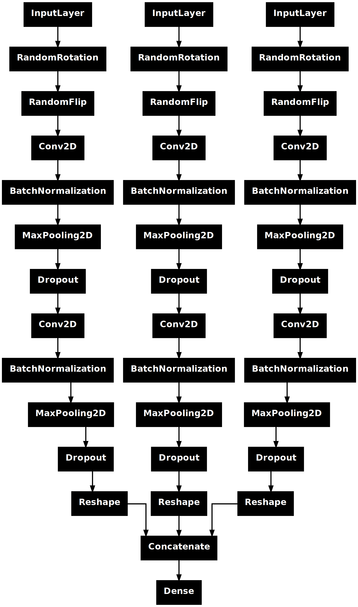

# 🚀 Configuration

In a Convolutional Neural Network (CNN), key parameters such as `kernel_size`, `strides`, `padding`, and `activation` function determine the feature extraction and learning process, influencing the network’s ability to capture spatial hierarchies and improve classification or regression performance.




## 📝 CNN Fine tuned parameters

This dictionary of parameters is located in the ``` /<ROOT FOLDER>/maati/Configuration/configuration.py ```

```python
cnn_fine_tuning = {
    "neurons_numbers": 60,
    "stride": (1, 1),
    "regularization": tf.keras.regularizers.L2(0.06),
    "rotation_factor": (-0.2, 0.5),
    "dropout_rate": 0.1
}

```

<table align="center">
  <tr>
    <th>Parameter</th>
    <th>Values</th>
  </tr>
  <tr>
    <td>neurons_numbers</td>
    <td>Number of unit used in the Convolution layer</td>
  </tr>
  <tr>
    <td>stride</td>
    <td>This parameters is used in the Convolution layer</td>
  </tr>
  <tr>
    <td>regularization</td>
    <td>Use L2 regularization or replace with None if you do not need it</td>
  </tr>
   <tr>
    <td>rotation_factor</td>
    <td>random rotation is used in data augmentation step replace with None if you do not need</td>
  </tr>
    <tr>
    <td>dropout_rate</td>
    <td>dropout rate or None if you do not need it</td>
  </tr>
</table>


## 📝 CNN parameters


```python
# rest cnn each channel change
cnn_configuration = {
    "input_channel_1": None,
    "input_channel_3": None,
    "input_channel_2": None,
    'input_channel_4': None,
    'input_channel_5': None,
    "neuron_numbers": cnn_fine_tuning["neurons_numbers"],
    "kernel_channel_1": None,
    "kernel_channel_3": None,
    "kernel_channel_2": None,
    "kernel_channel_4": None,
    "kernel_channel_5": None,
    "inputs": config["INPUTS"],
    "output": None,
    "stride": cnn_fine_tuning["stride"],
    "regularization": cnn_fine_tuning["regularization"],
    "data_augmentation": True,
    'rotation_factor': cnn_fine_tuning["rotation_factor"],
    "last_activation": 'softmax',
    "dropout_rate": cnn_fine_tuning["dropout_rate"]
}

```

<table align="center">
  <tr>
    <th>Parameter</th>
    <th>Values</th>
  </tr>
  <tr>
    <td>input_channel_*</td>
    <td>The input shape of the CNN. * is the input number</td>
  </tr>
  <tr>
    <td>kernel_channel_*</td>
    <td>Specify the weight and high of nthe filter (in this case is total number of bands in the channel)</td>
  </tr>
  <tr>
    <td>inputs</td>
    <td>Force certain number of the CNN input</td>
  </tr>
   <tr>
    <td>output</td>
    <td>Numbers of output nodes</td>
  </tr>
  <tr>
    <td>data_augmentation</td>
    <td>True or False</td>
  </tr>
    <tr>
    <td>last_activation</td>
    <td>softmax is used as final classifier</td>
  </tr>
</table>


The ``` input_channel_* ```, ``` kernel_channel_* ```, and ```output ``` are automatically handled by the algorithm. 