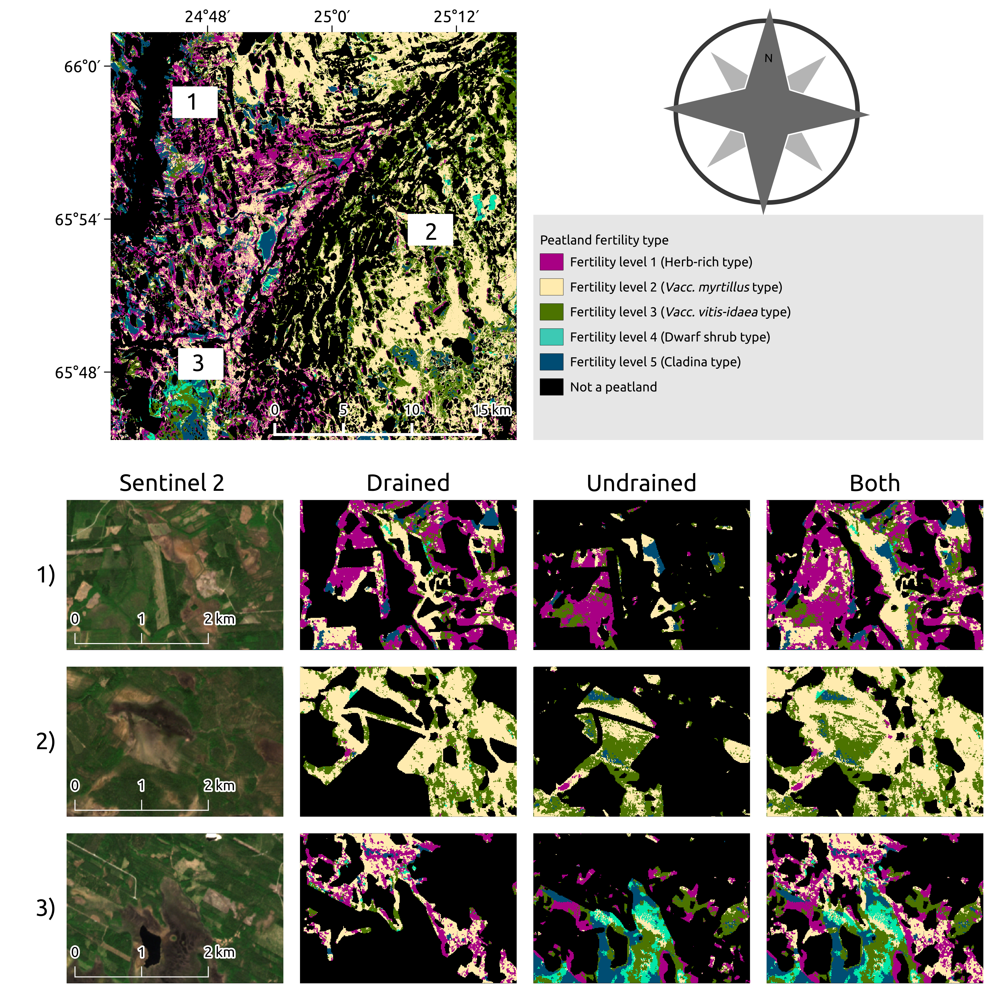
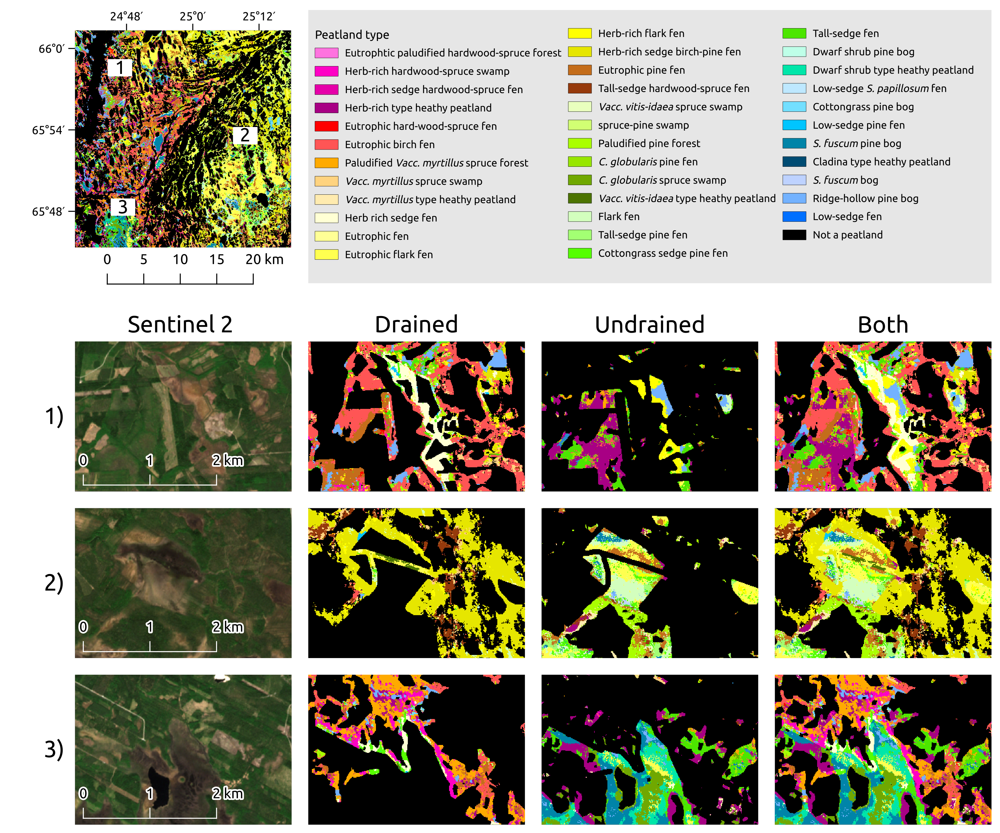

# 🚀 Peatland Pixel-level Classification via Multispectral, Multiresolution and Multisensor data using Convolutional Neural Network

The software presented here is part of a high-spatial-resolution peatland database for Finland. Advances in Soil Information-MaaTi project produced methodology and software which distinguishes mire site types, nutrient status and current land use. Since each country has different public data about nature resources, 
we publish the project software and a synthetic data from three random channels. 

This project used diffrent remote sensing sources, including optical and synthetic aperture radar (SAR) imagery, airborne laser scanning (ALS)
data, and multi-source national forest inventory (MS-NFI) datasets. 

# Get Started

- [Installation](#-installation)
- [Create Synthetic data to test the code](#create-synthetic-data-to-test-the-code)
- [Create a master file](#-create-a-master-file)
- [Create spatial window regions based on the annotation samples ](#create-spatial-window-regions-based-on-the-annotation-samples)
- [Feature Selection](#feature-selection)
- [Train the CNN model with selected features](#train-the-cnn-model-with-selected-features)
- [Pixel-wise classification](#pixel-wise-classification)
- [Acknowledgements](#acknowledgements)
- [Citing](#citing)
# Details
- [Go to CNN configuration](Documents/CNN.md)
- [Go to Configuration](Documents/Configuration.md)
- [How to use the code with own data](Documents/UseYourdata.md)

# 📝 Installation

### Clone this Repo
```bash
git clone https://github.com/MaaTi/CNN_peatland
cd MaaTi/CNN_peatland
```
### Creat the Conda environment 
```bash
# move to requirement folder
cd /<ROOT FOLDER>/CNN_peatland/Requirements
conda env create -f install_me.yml
```

### Activate the Conda environment 

You can activate the Conda enviroenment by running the following command in the terminal

```bash
conda activate maati_transformer
```

# Create Synthetic data to test the code 
We assume you mihgt have several raster layers starting from satellite channels (SAR, Landsat) to aerial measurements
(kalium gamma, electric conductivity of the surface) and a ground DEM. Each of these have originally different raster 
sizes, so we assume a grid unification has been done (e.g. using bilinear interpolation). The synthetic data provided is randomly generated but has the mean and variance from three channels: SAR, DEM, NFI. 


```bash
# move to requirement folder
cd /<ROOT FOLDER>/CNN_peatland/CreateSyntheticData

# write to create synthethic raster  and no data raster(random generated)
python create_synthethic_rasters.py 

# write to create random annotations 
python create_synthetic_annotations.py
```
The raster are generated in the Datasets folder. 

# Create a master file

The master file is a summary file that contains the paths of raster datasets, specifies which input of the multi-modal Convolutional Neural Network each raster corresponds to, identifies the no-data value, and defines the replacement value for missing data.

```bash
# move to requirement folder
cd /<ROOT FOLDER>/CNN_peatland/CreateSyntheticData

# write to generate a master file to handle pathes of raster for other steps 
python create_masterfile.py
```

The Master file content look like:

```bash
../Datasets/TestArea/Derived,channel_3,255,0
../Datasets/TestArea/Forest,channel_2,255,0
../Datasets/TestArea/Optical,channel_1,255,0
```
where ``` ../Datasets/TestArea/Derived ``` is the path to the folder that contains rasters. ``` channel_x ``` is the input of the CNN   ``` 255 ``` is the no data value of the raster and  ``` 0``` is the value used to substitute the no data value. This will generate a file ``` <ROOT FOLDER>/Masterfiles/dataset_test_area.csv ```. 

# Create spatial window regions based on the annotation samples 

In this step the algorithm will create a windows with the annoation point in the center. 


```bash
# navigate to 
cd /<ROOT FOLDER>/CNN_peatland/ManageDataset
# For linux user
source create_windows.sh

Prompt -> Insert area
Reply example -> TESTAREA

Prompt -> insert the path of the inputs
Reply example -> ../Configuration/Masterfiles/dataset_test_area.csv

Prompt-> Override windoiws dimension YES or NO
Reply example -> YES
```

or 

```bash
# List files in a directory
cd /<ROOT FOLDER>/CNN_peatland/ManageDataset

# from prompt 
python create_dataset.py -area name_of_your_zone \
                         -path_list path_to_your_masterfile \
                         -override_channel override current windiws dimension

```

Parameters guide:

<table align="center">
  <tr>
    <th>Parameter</th>
    <th>Values</th>
  </tr>
  <tr>
    <td>area</td>
    <td>Zone name of the analysis</td>
  </tr>
  <tr>
    <td>path_list</td>
    <td>Path to your masterfile </td>
  </tr>
  <tr>
    <td>area</td>
    <td>If you want to use different windows dimension instead of the ones in the configuration file </td>
  </tr>
</table>

Windows will be generated in ``` Windows/<AREA NAME> ```. 


# Feature Selection

The feature selection process consists of two stages. In the first stage, the algorithm evaluates each input individually and records the raster with the highest accuracy. In the second stage, it applies a greedy forward selection strategy, progressively stacking input bands. At the end of the process, the combination that achieves the highest accuracy is selected as the optimal configuration.

```bash
# navigate to 
cd /<ROOT FOLDER>/CNN_peatland/FeatureSelection

# For linux user
source input_selection.sh 

# select now 

Prompt -> Write the area you want to analyse
Repy example -> TESTAREA

Prompt -> Do you want to me to run the first or second stage?
Repy  example->  first

Prompt -> Do you want to me to run the drained or undrained?
Reply example -> drained

```

or 

```bash
# navigate to 
cd /<ROOT FOLDER>/CNN_peatland/FeatureSelection

# run 

python input_selection_first_step.py -area name_of_your_zone \
                                     -types type of data you want to analyse 

```

Parameters guide:

<table align="center">
  <tr>
    <th>Parameter</th>
    <th>Values</th>
  </tr>
  <tr>
    <td>area</td>
    <td>Zone name of the analysis</td>
  </tr>
  <tr>
    <td>types</td>
    <td>Types of data you want to run </td>
  </tr>
</table>

The results will be generated at ``` <AREA NAME>/Results/input_selection_first_stage_Type_of_data```. 

For each input the algorithm generates a folder with the name of the input and it will save predictions and true labels and keras weights.

```bash
├── Accuracy_train_list_1.csv
├── derived_0
│   ├── predictions
│   └── weights
├── derived_1
│   ├── predictions
│   └── weights
├── derived_2
│   ├── predictions
│   └── weights
├── derived_3
│   ├── predictions
│   └── weights
├── forest_0
│   ├── predictions
│   └── weights
├── forest_1
│   ├── predictions
│   └── weights
├── forest_2
│   ├── predictions
│   └── weights
├── forest_3
│   ├── predictions
│   └── weights
├── optical_0
│   ├── predictions
│   └── weights
├── optical_1
│   ├── predictions
│   └── weights
├── optical_2
│   ├── predictions
│   └── weights
├── optical_3
│   ├── predictions
│   └── weights
├── optical_4
│   ├── predictions
│   └── weights
├── optical_5
│   ├── predictions
│   └── weights
├── summary_1.csv

```

The summary_1.csv file contains a summary of the recorded accuracies. It looks like:

```
channel_1,../Windows/TestArea/drained/Optical,optical_2,mean of statified kfold accuracy.
```

where ``` channel_1 ``` is the path of the input, ``` ../Windows/TestArea/drained/Optical ```and  ```optical_2 ``` is the name of the raster, and ``` mean of statified kfold accuracy ``` is the recorded accuracy.


In the next step the greedy forward feature selection is started:

```bash
# navigate to 
cd /<ROOT FOLDER>/CNN_peatland/InputSelection

# For linux user
source input_selection.sh 

# select now 
Prompt -> Write the area you want to analyse
Repy example -> TESTAREA

Prompt -> Do you want to me to run the first or second stage?
Repy  example->  second

Prompt -> Do you want to me to run the drained or undrained?
Reply example -> drained
```

or 

```bash
# navigate to 
cd /<ROOT FOLDER>/CNN_peatland/InputSelection

python input_selection_second_stage.py -area name_of_your_zone \
                                       -types type of data you want to analyse 

```

Parameters guide:

<table align="center">
  <tr>
    <th>Parameter</th>
    <th>Values</th>
  </tr>
  <tr>
    <td>area</td>
    <td>Zone name of the analysis</td>
  </tr>
  <tr>
    <td>types</td>
    <td>Types of data you want to run </td>
  </tr>
</table>

The results will be generated at ``` <AREA NAME>/Results/input_selection_second_stage_Version_Type_of_data```. 

```bash
.
├── Accuracy_scored_list.csv
├── Round_0
│   ├── possible_combination_channel_1_channel_2
│   │   ├── optical_0_forest_0
│   │   │   ├── predictions
│   │   │   └── weights
│   │   ├── optical_0_forest_1
│   │   │   ├── predictions
│   │   │   └── weights
│   │   ├── optical_0_forest_2
│   │   │   ├── predictions
│   │   │   └── weights
│   │   ├── optical_1_forest_0
│   │   │   ├── predictions
│   │   │   └── weights
│   │   ├── optical_1_forest_1
│   │   │   ├── predictions
│   │   │   └── weights
│   │   ├── optical_1_forest_2
│   │   │   ├── predictions
│   │   │   └── weights
│   │   ├── optical_2_forest_0
│   │   │   ├── predictions
│   │   │   └── weights
│   │   ├── optical_2_forest_1
│   │   │   ├── predictions
│   │   │   └── weights
│   │   ├── optical_2_forest_2
│   │   │   ├── predictions
│   │   │   └── weights
│   │   ├── optical_3_forest_0
│   │   │   ├── predictions
│   │   │   └── weights
│   │   ├── optical_3_forest_1
│   │   │   ├── predictions
│   │   │   └── weights
│   │   ├── optical_3_forest_2
│   │   │   ├── predictions
│   │   │   └── weights
│   │   ├── optical_4_forest_0
│   │   │   ├── predictions
│   │   │   └── weights
│   │   ├── optical_4_forest_1
│   │   │   ├── predictions
│   │   │   └── weights
│   │   └── optical_4_forest_2
│   │       ├── predictions
│   │       └── weights
│   ├── possible_combination_channel_1_channel_3
│   │   ├── optical_0_derived_0
│   │   │   ├── predictions
│   │   │   └── weights
│   │   ├── optical_0_derived_1
│   │   │   ├── predictions
│   │   │   └── weights
│   │   ├── optical_0_derived_2
│   │   │   ├── predictions
│   │   │   └── weights
│   │   ├── optical_1_derived_0
│   │   │   ├── predictions
│   │   │   └── weights
│   │   ├── optical_1_derived_1
│   │   │   ├── predictions
│   │   │   └── weights
│   │   ├── optical_1_derived_2
│   │   │   ├── predictions
│   │   │   └── weights
│   │   ├── optical_2_derived_0
│   │   │   ├── predictions
│   │   │   └── weights
│   │   ├── optical_2_derived_1
│   │   │   ├── predictions
│   │   │   └── weights
│   │   ├── optical_2_derived_2
│   │   │   ├── predictions
│   │   │   └── weights
│   │   ├── optical_3_derived_0
│   │   │   ├── predictions
│   │   │   └── weights
│   │   ├── optical_3_derived_1
│   │   │   ├── predictions
│   │   │   └── weights
│   │   ├── optical_3_derived_2
│   │   │   ├── predictions
│   │   │   └── weights
│   │   ├── optical_4_derived_0
│   │   │   ├── predictions
│   │   │   └── weights
│   │   ├── optical_4_derived_1
│   │   │   ├── predictions
│   │   │   └── weights
│   │   └── optical_4_derived_2
│   │       ├── predictions
│   │       └── weights
│   └── possible_combination_channel_2_channel_3
│       ├── forest_0_derived_0
│       │   ├── predictions
│       │   └── weights
│       ├── forest_0_derived_1
│       │   ├── predictions
│       │   └── weights
│       ├── forest_0_derived_2
│       │   ├── predictions
│       │   └── weights
│       ├── forest_1_derived_0
│       │   ├── predictions
│       │   └── weights
│       ├── forest_1_derived_1
│       │   ├── predictions
│       │   └── weights
│       ├── forest_1_derived_2
│       │   ├── predictions
│       │   └── weights
│       ├── forest_2_derived_0
│       │   ├── predictions
│       │   └── weights
│       ├── forest_2_derived_1
│       │   ├── predictions
│       │   └── weights
│       └── forest_2_derived_2
│           ├── predictions
│           └── weights
├── summary_best.txt
```
Same as before ther code generate for each Round and each combination of inputs weights and predicted and true labels. The best combinatin is generate at the end of each round and it will look like this:

```bash
channel_1,../Windows/TestArea/drained/Optical/optical_5
+
channel_2,../Windows/TestArea/drained/Forest/forest_3
+
channel_2,../Windows/TestArea/drained/Forest/forest_1
+
channel_3,../Windows/TestArea/drained/Derived/derived_3
+
=
Mean of cv accuracy X
```

The resulted best combination is given by the one that achieves best accuracy. 


# Train the CNN model with selected features 

```bash
# navigate to 
cd /<ROOT FOLDER>/CNN_peatland/TrainBestCombination

# type
source train_best_combination.sh 

Prompt -> Write the area you want to analyse
Reply example -> TESTAREA

Prompt -> Do you want to me to run the drained or undrained?
Reply -> drained 
```

or

```bash
# navigate to 
cd /<ROOT FOLDER>/CNN_peatland/TrainBestCombination

# run 
python train_best_combination.py -area name_of_your_zone \
                                 -types type of data you want to analyse  
```

Parameters list: 

<table align="center">
  <tr>
    <th>Parameter</th>
    <th>Values</th>
  </tr>
  <tr>
    <td>area</td>
    <td>Zone name of the analysis</td>
  </tr>
  <tr>
    <td>types</td>
    <td>Types of data you want to run </td>
  </tr>
</table>

The weights will be saved into the ``` <AREA NAME>/Results/BestCombination/type_of_data/weights ```.

# Pixel-wise classification

In this work pixelwise classification occours in two phases:

## Parallel processing

In this phases the raster is divided into smaller subrater in order to make computation faster. This is achieved by running the following script:

```bash
# navigate to 
cd /<ROOT FOLDER>/CNN_peatland/PixelWiseClassification

#run 
source prepare_the_command.sh

Prompt -> Write the area you want to analyse
Reply example ->  TESTAREA

Prompt -> Write pixel size in meter
read example -> 10

Prompt -> Write how many cpu / cores you have
Reply example -> 20

Prompt Write path to the dataset
Reply example -> path_to_dataset

```

or 

```bash
# navigate to 
cd /<ROOT FOLDER>/CNN_peatland/PixelWiseClassification

python pixelwise_classification_create_commands.py -area Zone name of the analysis \
                                                   --opix Override the current spatial resolution \
                                                   --ocpu amount of cpus \
                                                   --path_to_dataset path to your rasters

```
Parameters list: 

<table align="center">
  <tr>
    <th>Parameter</th>
    <th>Values</th>
  </tr>
  <tr>
    <td>area</td>
    <td>Zone name of the analysis</td>
  </tr>
  <tr>
    <td>opix</td>
    <td>Override the current spatial resolution</td>
  </tr>
   <tr>
    <td>ocpu</td>
    <td>write how many cores you have at your disposal to make the analysis in parallel </td>
  </tr>
   <tr>
    <td>path_to_dataset</td>
    <td>write the root path to your raster default value is ../Dataset/AREA_NAME </td>
  </tr>
</table>

The generated list of commands is saved into the ``` /<ROOT FOLDER>/CNN_peatland/PixelWiseClassification/launch_commander/launch_commander_AREA_NAME.txt ``` folder. 


## Classification map generation

```bash
# navigate to 
cd /<ROOT FOLDER>/CNN_peatland/PixelWiseClassification

source run_pixelwise_classification.sh

# prompt
Prompt -> "Enter the path of the launch commander"
Reply -> PixelWiseClassification/launch_commander/launch_commander_testarea.txt
```

## Rebuilt final raster

```bash
# navigate to 
cd /<ROOT FOLDER>/CNN_peatland/Rebuilt

python create_array_from_workers.py -folder output folder of the pixelwise classification step.
```

Parameters list:

<table align="center">
  <tr>
    <th>Parameter</th>
    <th>Values</th>
  </tr>
  <tr>
    <td>folder</td>
    <td>Output folder of the pixelwise classification step</td>
  </tr>
</table>

The output will be saved into the ``` /<ROOT FOLDER>/CNN_peatland/Rebuilt/saved_array ```.

In the same folder create a raster from the rebuilt array:

```bash
# navigate to 
cd /<ROOT FOLDER>/CNN_peatland/Rebuilt

python create_raster_from_array.py.
```


## Examples of output maps 

<div class="container">
  <div class="row">
    
  </div>
  <p align="center"> An example of Fertility level classification map [1].</p>
</div>

<br>

<div class="container">
  <div class="row">
    
  </div>
  <p align="center">An example of Soil types classification map [1]. </p>
</div>

# Acknowledgements
This work is part of the Advances in soil information- MaaTi project funded by the
Ministry of Agriculture and Forestry of Finland (2021-2022, funding decision VN/27416/2020-MMM-2). The authors
wish to acknowledge CSC – IT Center for Science, Finland,
for computational resources, and the MaaTi project management and steering group for constructive comments during the work. The TerraSAR-X and RADARSAT-2 data were supplied through the European Space Agency's Third party mission proposals no. 36096 “Remote sensing as a tool for mapping and evaluating peatlands and peatland carbon stock in Northern Finland; Radarsat-2” and  no. 36096 “Remote sensing as a tool for mapping and evaluating peatlands and peatland carbon stock in Northern Finland; Radarsat-2" and by Maarit Middleton in year 2017.

# Citing
If you have used our code in your research, please cite our work. 
```
[1] Luca Zelioli, Fahimeh Farahnakian, Maarit Middleton, Timo P.Pitkänen, Sakari Tuominen, Paavo Nevalainen, Jonne Pohjankukka, Jukka Heikkonen, “Peatland Pixel-level Classification via Multispectral, Multiresolution and Multisensor data using Convolutional Neural Network”, Elsevier Ecological Informatics, 2025 (Under revision).
```
